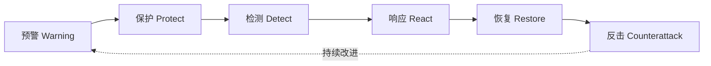

# 18.4 信息安全整体架构设计（WPDRRC 模型）

## 1. 本节核心思想

信息安全不能只依靠单一技术，而应以人员、策略和技术为三大要素，建立涵盖预警、保护、检测、响应、恢复和反击的动态安全保障闭环，并从物理、系统、网络、应用和管理五个方面进行整体架构设计。

## 2. 考试高频考点

* **考点1：WPDRRC模型的六个环节**
  WPDRRC依次包括预警、保护、检测、响应、恢复和反击，强调安全保障的动态性、时序性和完整闭环。

* **考点2：WPDRRC模型的三大要素**
  人员是核心，策略是桥梁，技术是保证，三者共同落实到WPDRRC六个安全环节中。

* **考点3：六个环节对应的典型措施**
  预警对应风险评估和模拟攻击；保护对应加密、认证、访问控制和防火墙；检测对应入侵检测和漏洞检测；响应对应报警、封堵和隔离；恢复对应备份、冗余和容灾；反击对应追踪、取证和依法打击。

* **考点4：信息安全体系架构的五个方面**
  安全控制系统应从物理安全、系统安全、网络安全、应用安全和管理安全五个方面进行分析和设计。

* **考点5：系统安全保障体系的三个层面**
  系统安全保障体系由安全服务、协议层次和系统单元三个层面组成，每个层面都贯穿安全管理。

* **易混点：PDRR、MPDRR与WPDRRC的区别**
  PDRR包括保护、检测、响应和恢复；MPDRR在PDRR基础上增加管理；WPDRRC进一步增加预警和反击，是功能较完整的动态安全保障模型。

* **易混点：预警与检测的区别**
  预警是在安全事件发生前识别风险、漏洞和发展趋势；检测是在系统运行过程中发现已经出现或正在发生的攻击与异常。

* **易混点：响应与恢复的区别**
  响应强调发现安全事件后的封堵、隔离、报警和处置；恢复强调事件造成破坏后，通过备份、冗余和修复使业务恢复正常。

* **易考选择题：WPDRRC模型的特殊能力**
  WPDRRC是我国提出的安全保障模型，与其他常见模型相比，明确增加了预警和反击功能。

* **易考选择题：安全管理的基本建设要求**
  网络安全管理至少应建立一个安全运行组织、制定一套安全管理制度，并建立一个应急响应机制。

## 3. 记忆口诀

### 口诀一：WPDRRC六环节

**“预防检应恢反”**

### 解释

* **预**：预警，提前发现风险和薄弱环节；
* **防**：保护，通过加密、认证、防火墙等进行防护；
* **检**：检测，监控并发现攻击、漏洞和异常；
* **应**：响应，及时报警、封堵、隔离和处置；
* **恢**：恢复，通过备份、冗余和容灾恢复业务；
* **反**：反击，追踪攻击者、收集证据并依法处理。

### 口诀二：三大要素

**“人核、策桥、技保”**

### 解释

人员是安全体系的核心，策略连接安全目标与具体实施，技术为安全措施落地提供保障。

### 口诀三：五类安全

**“物系网应管”**

### 解释

分别对应物理安全、系统安全、网络安全、应用安全和管理安全。

## 4. 考试一句话总结（精简）

本节最可能考查WPDRRC六个环节及典型安全措施的对应关系，以及人员、策略、技术三大要素和五类安全架构。
